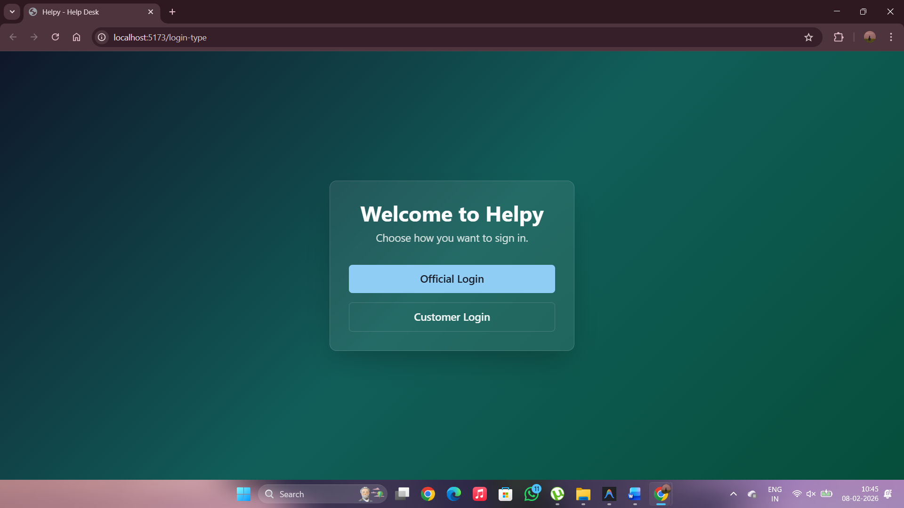
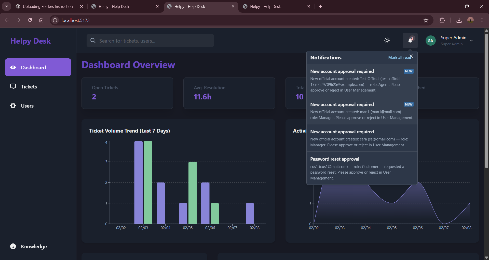
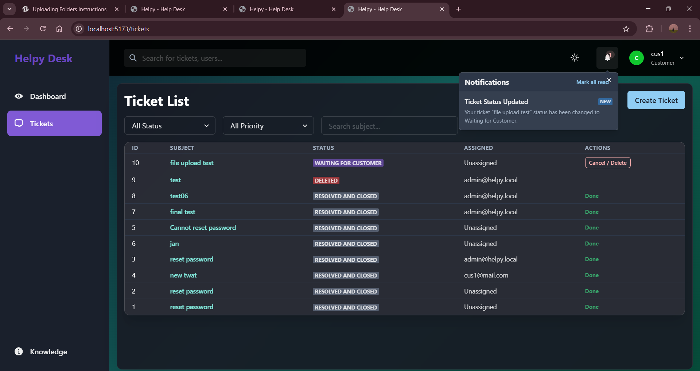
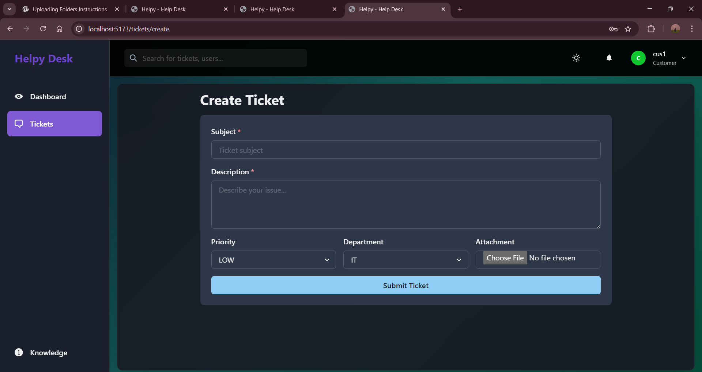
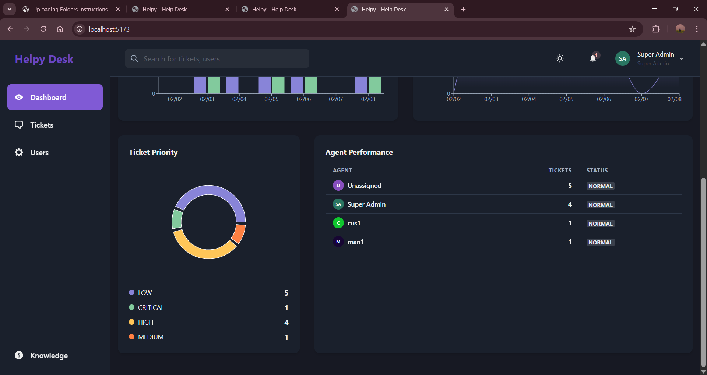

# Helpdesk Application

A full-stack Helpdesk/Ticketing System designed to manage customer queries, service requests, SLA tracking, and escalations.

## 🚀 Features
- User Authentication (JWT-based)
- Role-Based Access Control (Admin, Agent, Customer)
- Ticket Management System
- SLA Tracking & Escalation
- File Upload Support
- Reports & Analytics Dashboard

## 🛠️ Tech Stack
Frontend:
- React
- Tailwind CSS

Backend:
- Node.js
- Express.js

Database:
- MySQL / PostgreSQL

## 📂 Project Structure
- frontend/
- backend/

## ▶️ How to Run
1. Clone the repo
2. Run `npm install`
3. Start backend and frontend

## 📸 Screenshots

### Login Page

### Dashboard

### Ticket System

### Create Ticket

### Analysis / Reports

## 🔗 GitHub
https://github.com/Shreekanth162006/helpdesk-application
